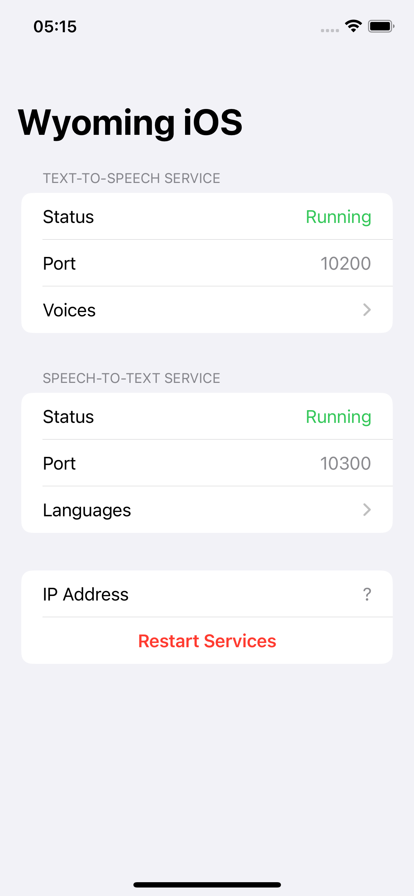

# PomumD

[Wyoming Protocol](https://github.com/OHF-Voice/wyoming) text-to-speech (TTS) and speech-to-text (STT) server using iOS AVFoundation and Speech frameworks, on-device processing only.

Runs on iOS/iPadOS 16.0+ and macOS 13.0+ devices.

## Text-to-Speech

[AVSpeechSynthesizer](https://developer.apple.com/documentation/avfaudio/avspeechsynthesizer) of AVFoundation framework.

- Supports over 60 languages available in [Spoken Content](https://www.apple.com/ios/feature-availability/#accessibility-voiceover), with all the available voices (compact, enhanced, premium), except Siri voices.

> _Keep in mind that although Siri voices are available to be selected in Spoken Content Settings, they are not available through the AVSpeechSynthesizer API._
> (https://developer.apple.com/videos/play/wwdc2020/10022/?time=213)

- Supports a subset of SSML tags, no documentation available from Apple yet, some tags will crash the synthesizer (`EXC_BAD_ACCESS`) on certain OS versions.

- Supports Wyoming TTS streaming mode. The input text is chunked into sentences automatically using [NLTokenizer](https://developer.apple.com/documentation/naturallanguage/nltokenizer) provided by the Natural Language framework; or chunked by first-level tags when SSML is used.

## Speech-to-Text

For iOS/iPadOS/macOS 26.0+: [SpeechTranscriber](https://developer.apple.com/documentation/speech/speechtranscriber) of Speech framework.

For others: [SFSpeechRecognizer](https://developer.apple.com/documentation/speech/sfspeechrecognizer).

- Supports over 60 languages available in [Dictation](https://www.apple.com/ios/feature-availability/#dictation).

## Other Features

- HTTP health check endpoint at `/health`.
- Prometheus metrics endpoint at `/metrics`.
- Screensaver to prevent OLED burn-in.

## TODO

- [ ] Fix SSML validation to prevent crashes.
- [ ] On-device LLM using Foundation Models framework (iOS/iPadOS/macOS 26.0+ only).
- [ ] Support for other TTS and STT models using MLX.

## Screenshot

